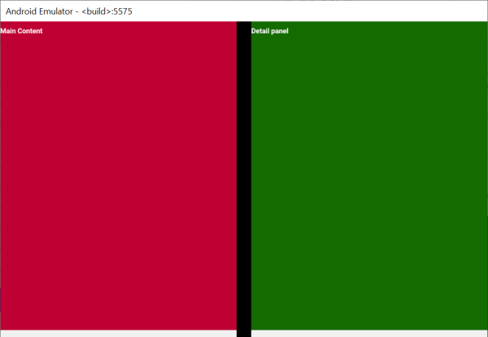
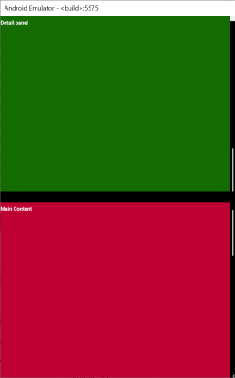
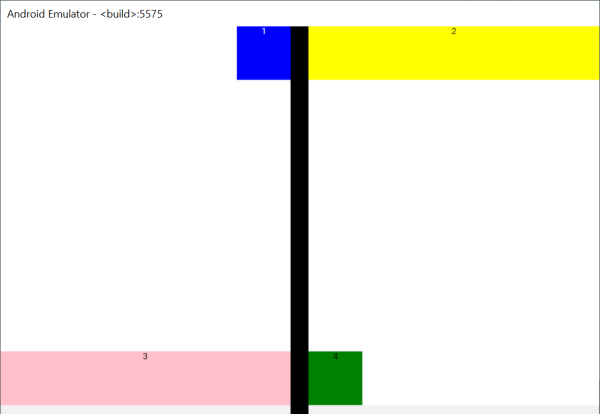
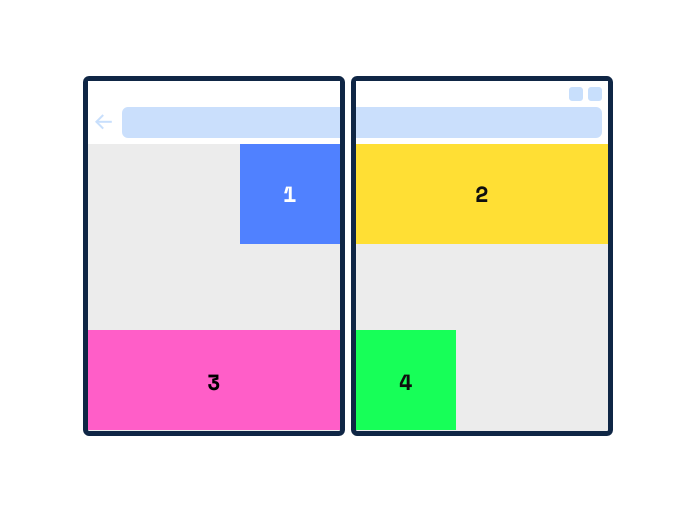

# WebView Demo

Sample HTML page in a WebView hosted in a native Android Java app, enhanced for the Surface Duo.

Takes the very basic demo from this [device configurator](https://github.com/foldable-devices/device-configurator) and removes the configurator, instead using Java to natively detect the dual-screen and manually set the values used by the polyfill.

The `screen-spanning` media feature currently accepts three values:

- `none`
- `single-fold-vertical`
- `single-fold-horizontal`

One of these is selected, along with the `foldSize`, in Java code via `evaluateJavascript`.

The CSS contains these media entries to adapt the page as the app is spanned or rotated:

```css
@media (spanning: single-fold-vertical) {
}
@media (spanning: single-fold-horizontal) {
}
@media (spanning: none) {
}
```

## Surface Duo screenshots

 

If you uncomment this line in MainActivity

```java
webView.loadUrl("https://assets/boxes.html");
```

the demo will switch to this set of colored boxes



which is based on [this absolute positioning demo](https://github.com/MicrosoftEdge/MSEdgeExplainers/blob/master/Foldables/explainer.md#colored-boxes-absolutely-positioned) from the [Edge foldables explainer](https://github.com/MicrosoftEdge/MSEdgeExplainers/blob/master/Foldables/explainer.md):



## Other links

- [Microsoft Edge foldables explainer](https://github.com/MicrosoftEdge/MSEdgeExplainers/blob/master/Foldables/explainer.md)
- [Chromium proposal](https://chromium-review.googlesource.com/c/chromium/src/+/2129994)
- [Battleship with configurator](https://foldable-devices.github.io/demos/battleship/)
- [Photo gallery with configurator](https://foldable-devices.github.io/demos/photo-gallery/)
