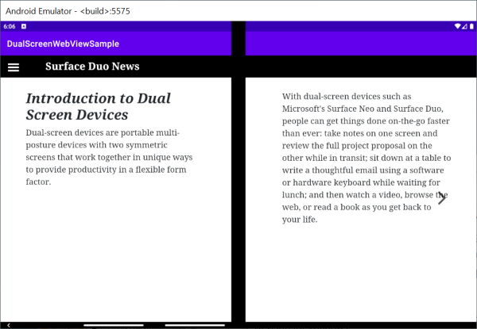
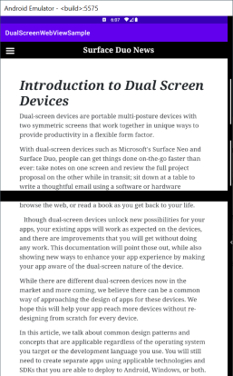

# WebView Sample

Sample HTML page in a WebView hosted in a native Android Java app, enhanced for the Surface Duo.

Takes this [Microsoft 365 Dev Days sample](https://devday2020e76c4a5534b64a.z21.web.core.windows.net/), and uses Java to natively detect the dual-screen and manually set the values used by the polyfill.

The `screen-spanning` media feature currently accepts three values:

- `none`
- `single-fold-vertical`
- `single-fold-horizontal`

One of these is selected, along with the `foldSize`, in Java code via `evaluateJavascript`.

The CSS contains these media entries to adapt the page as the app is spanned or rotated:

```css
@media (spanning: single-fold-vertical) {
}
@media (spanning: single-fold-horizontal) {
}
@media (spanning: none) {
}
```

## Surface Duo screenshots

 

## Other links

- [Chromium proposal](https://chromium-review.googlesource.com/c/chromium/src/+/2129994)
