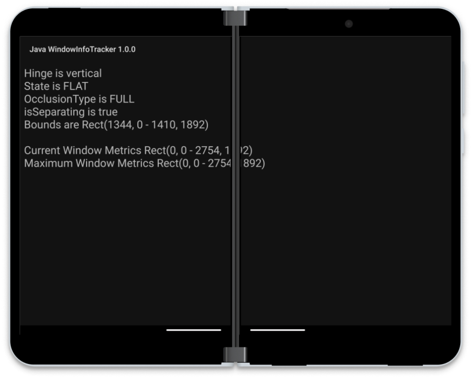

# Jetpack Window Manager for Java

Surface Duo sample that implements [Jetpack Window Manager alpha10](https://developer.android.com/jetpack/androidx/releases/window#window-1.0.0-alpha10) using Java and the **androidx.window:window-java** adapter package.



For Kotlin, refer to the [Surface Duo Window Manager samples repo](https://github.com/microsoft/surface-duo-window-manager-samples) and the [Android user-interface sample for Window Manager](https://github.com/android/user-interface-samples/tree/master/WindowManager).


## Using Java

The [alpha10 release](https://developer.android.com/jetpack/androidx/releases/window#window-1.0.0-alpha10) introduced a different API using the `WindowInfoRepository` class which is optimized for Kotlin, and a separate package **window-java** that includes a `WindowInfoRepositoryCallbackAdapter` that makes it easy to use from Java.

```gradle
dependencies {
    implementation "androidx.window:window:1.0.0-alpha10"
    implementation "androidx.window:window-java:1.0.0-alpha10"
```

```java
WindowInfoRepositoryCallbackAdapter wir;
//...
protected void onCreate(Bundle savedInstanceState) {
    super.onCreate(savedInstanceState);
    //...
    wir = new WindowInfoRepositoryCallbackAdapter(
            WindowInfoRepository.Companion.getOrCreate(
                    this
            )
    );
}
//...
    @Override
    protected void onStart() {
        super.onStart();
        wir.addWindowLayoutInfoListener(runOnUiThreadExecutor(), (windowLayoutInfo -> {
            List<DisplayFeature> displayFeatures = windowLayoutInfo.getDisplayFeatures();

            displayFeatures.forEach(displayFeature -> {
                FoldingFeature foldingFeature = (FoldingFeature)displayFeature;
                if (foldingFeature != null)
                {   // only set if it's a fold, not other feature type. only works for single-fold devices.
                    // do stuff with the hinge/fold
                }
            });
        }));
    }
```